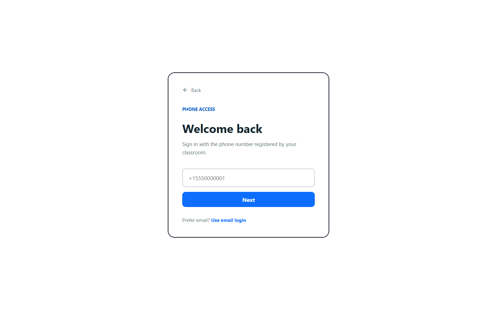
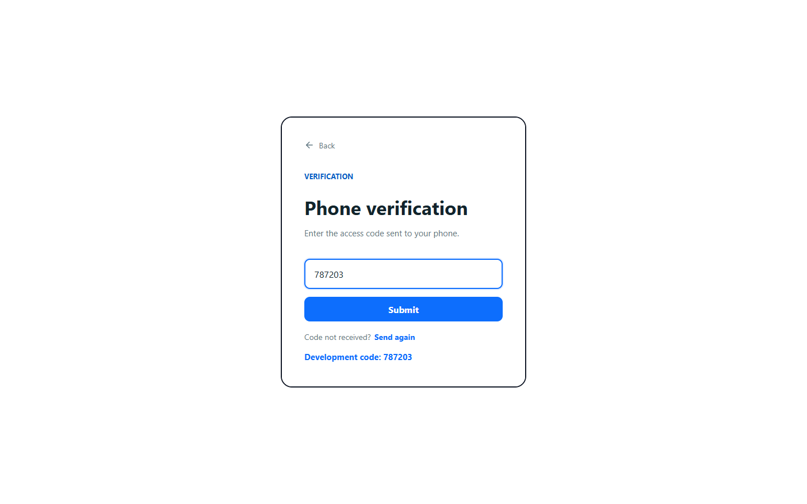
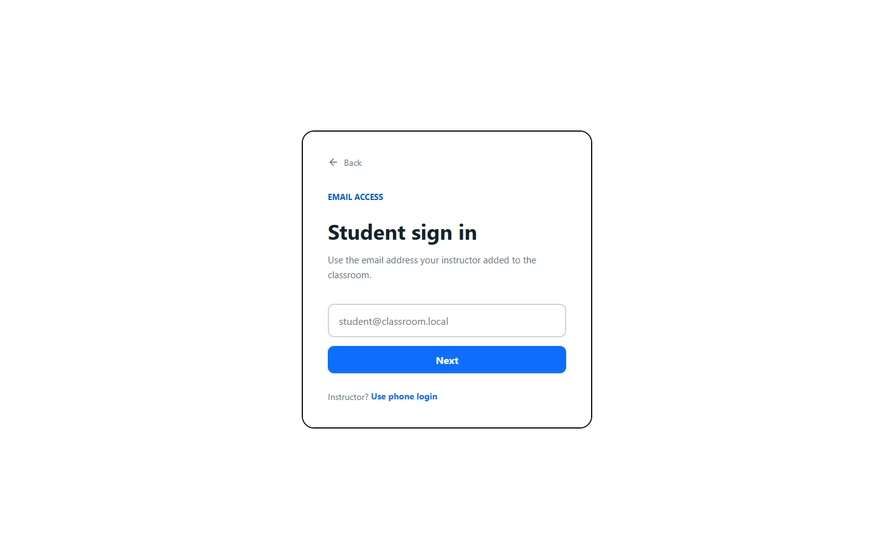
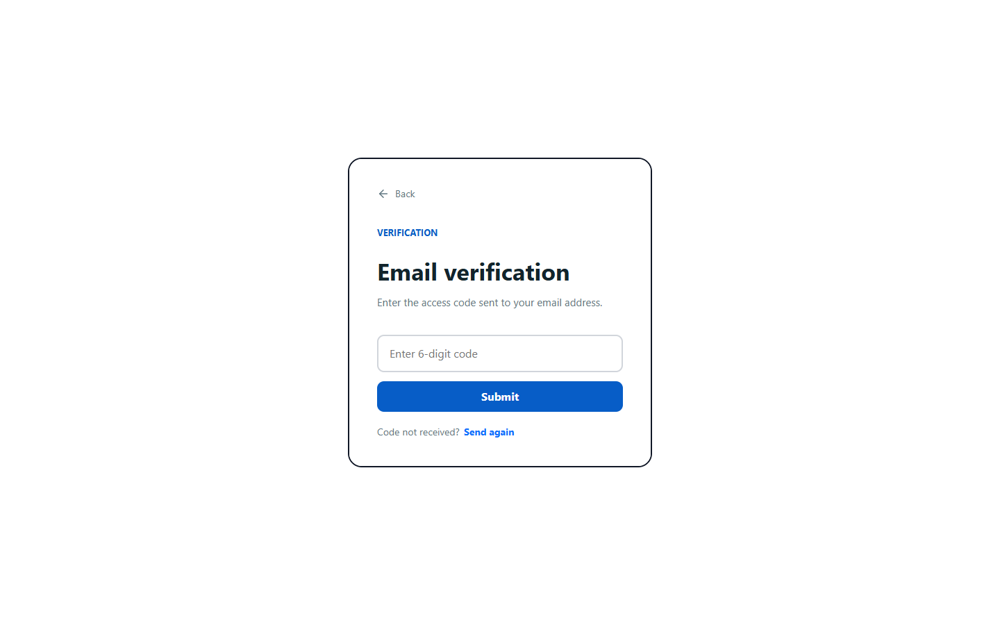
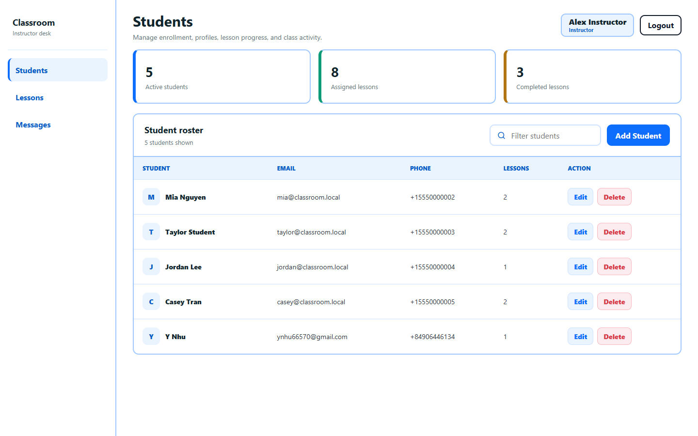
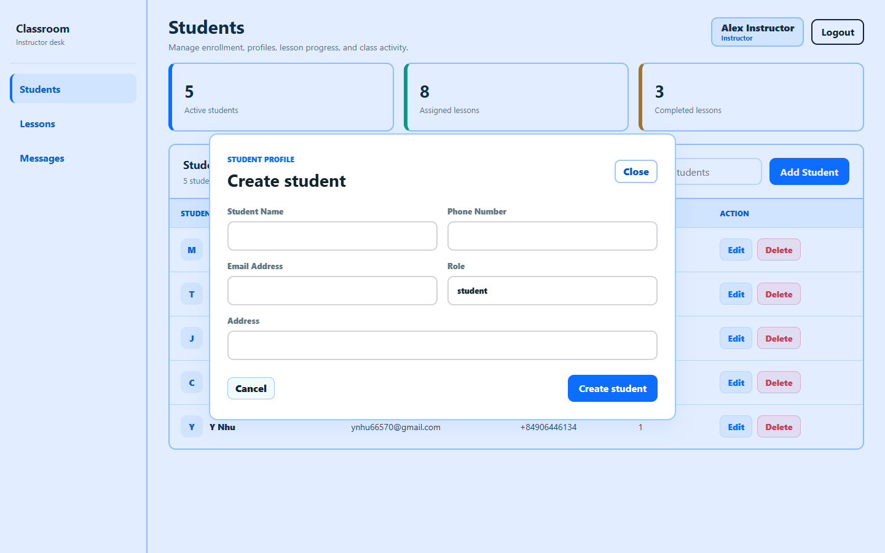
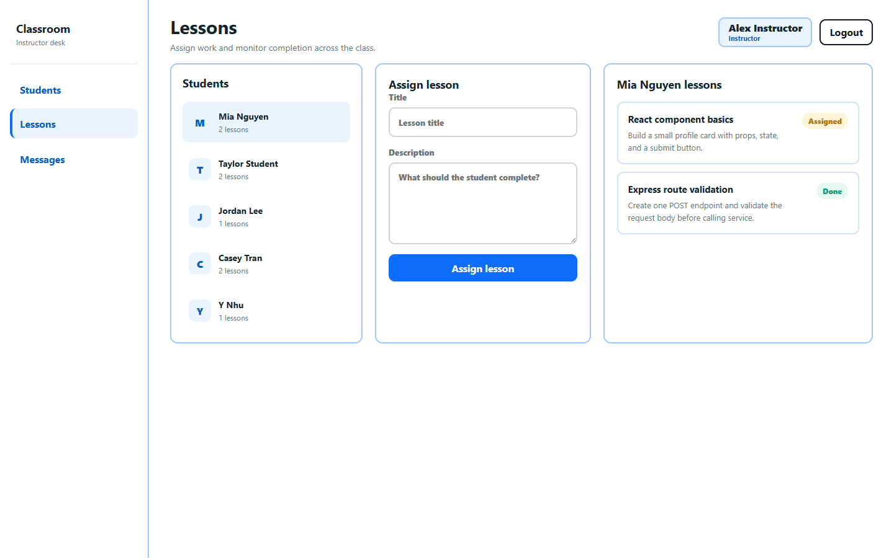
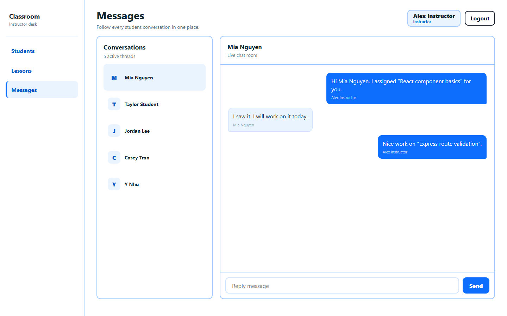
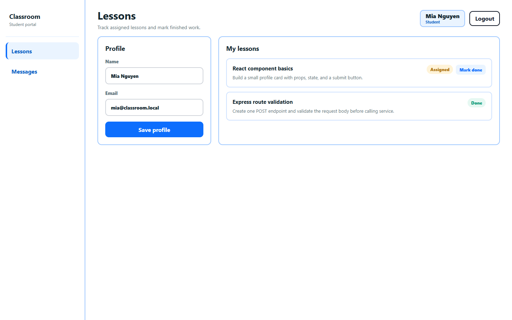
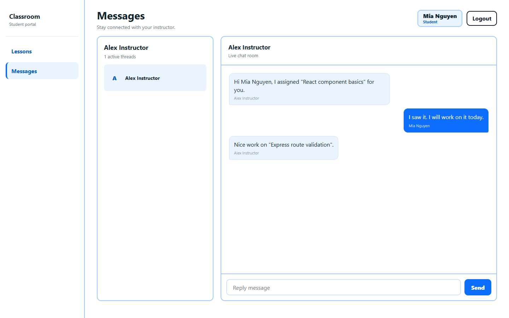

# Classroom Management

A full-stack classroom management application built with an Express backend, a React frontend, Firebase Firestore, Twilio SMS, email verification, and Socket.io chat.

Detailed documentation:

- [Backend README](./backend/README.md)
- [Frontend README](./frontend/README.md)

## Tech Stack

- Frontend: React, Vite, Axios, Socket.io Client
- Backend: Node.js, Express, Socket.io
- Database: Firebase Firestore
- Notifications: Twilio SMS, Nodemailer email

## Project Structure

```text
classroom-management/
|-- backend/
|   |-- src/
|   |   |-- integrations/
|   |   |   |-- email/
|   |   |   |-- firebase/
|   |   |   `-- twilio/
|   |   |-- modules/
|   |   |   |-- auth/
|   |   |   |-- chat/
|   |   |   `-- students/
|   |   |-- scripts/
|   |   |   `-- seedFirebase.js
|   |   |-- app.js
|   |   `-- server.js
|   |-- .env.example
|   |-- package.json
|   `-- README.md
|-- frontend/
|   |-- src/
|   |   |-- App.jsx
|   |   |-- App.css
|   |   `-- main.jsx
|   |-- .env.example
|   |-- package.json
|   `-- README.md
|-- screenshots/
|-- .gitignore
`-- README.md
```

The backend follows a Modular Monolith style with a layered flow:

```text
router -> controller -> service -> repository -> Firebase
```

## How To Run

### 1. Configure Backend Environment

Create `backend/.env` from `backend/.env.example`.

```env
PORT=4000
CLIENT_ORIGIN=http://localhost:5173

FIREBASE_PROJECT_ID=
FIREBASE_CLIENT_EMAIL=
FIREBASE_PRIVATE_KEY=

TWILIO_ACCOUNT_SID=
TWILIO_AUTH_TOKEN=
TWILIO_FROM_PHONE=

EMAIL_HOST=
EMAIL_PORT=465
EMAIL_SECURE=true
EMAIL_USER=
EMAIL_PASS=
EMAIL_FROM=
```

Twilio and email credentials are optional for local testing. If sending fails, the backend still keeps the authentication flow testable by returning a development access code.

### 2. Run Backend

```bash
cd backend
npm install
npm run seed
npm run dev
```

Backend URL:

```text
http://localhost:4000
```

### 3. Run Frontend

Open another terminal:

```bash
cd frontend
npm install
npm run dev
```

Frontend URL:

```text
http://localhost:5173
```

## Demo Accounts

Instructor login:

```text
+15550000001
```

Student email login:

```text
mia@classroom.local
```

## Screenshots

Screenshots are stored in the `screenshots/` folder.

### Phone Login



### Phone Verification



### Email Login



### Email Verification



### Instructor Student Management



### Add Student Form



### Instructor Lesson Assignment



### Instructor Chat



### Student Lessons



### Student Chat



## Quick Start After Packages Are Installed

Backend:

```bash
cd backend
npm run dev
```

Frontend:

```bash
cd frontend
npm run dev
```
